# Reading Tracker — Parent Setup Guide

A step-by-step visual walkthrough for setting up the Reading Tracker in Google Sheets.  
**No coding experience required.** The whole setup takes about 10 minutes.

---

## What you'll need before you start

| Item | Where to get it |
|------|----------------|
| A Google account | Already have one if you use Gmail |
| An AI provider API key | See [Which AI provider?](#which-ai-provider) below |
| Your child's reading schedule | E.g. Mon–Sat, 30 pages/day |

### Which AI provider?

Pick **one** — you only need one key:

| Provider | Best for | Get your key |
|----------|----------|--------------|
| **Claude** (recommended) | Thoughtful literary feedback | [console.anthropic.com](https://console.anthropic.com) → API Keys |
| **OpenAI** | Broad availability | [platform.openai.com](https://platform.openai.com) → API Keys |
| **Gemini** | Free tier available | [aistudio.google.com](https://aistudio.google.com) → Get API key |

---

## Step 1 — Create a new Google Sheet

Go to [sheets.google.com](https://sheets.google.com) and click **+ Blank** to create a new spreadsheet. Rename it something like **"Reading Tracker – [Child's Name] 2025"**.

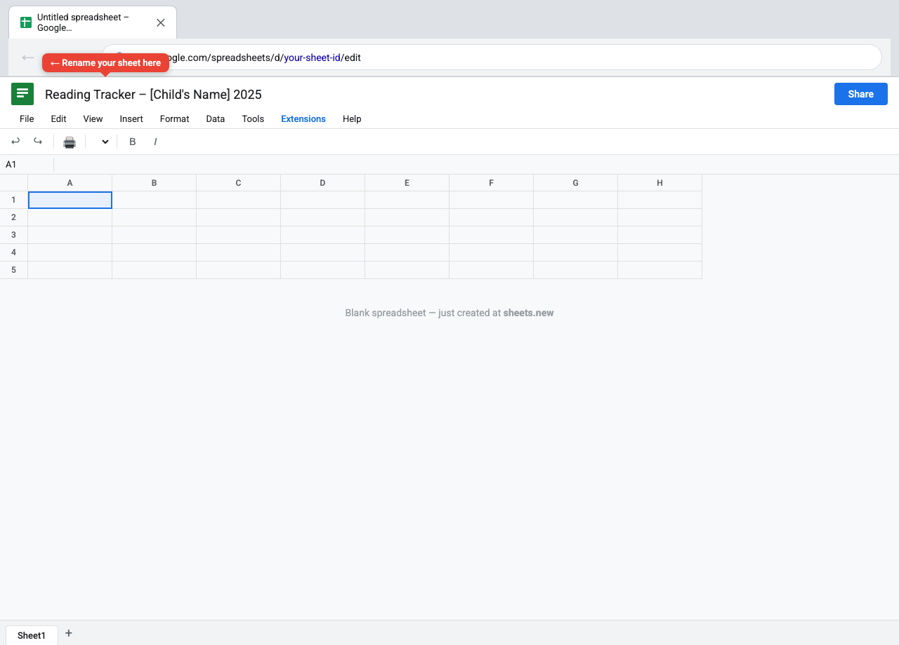

---

## Step 2 — Open the Script Editor

In the menu bar click **Extensions → Apps Script**.

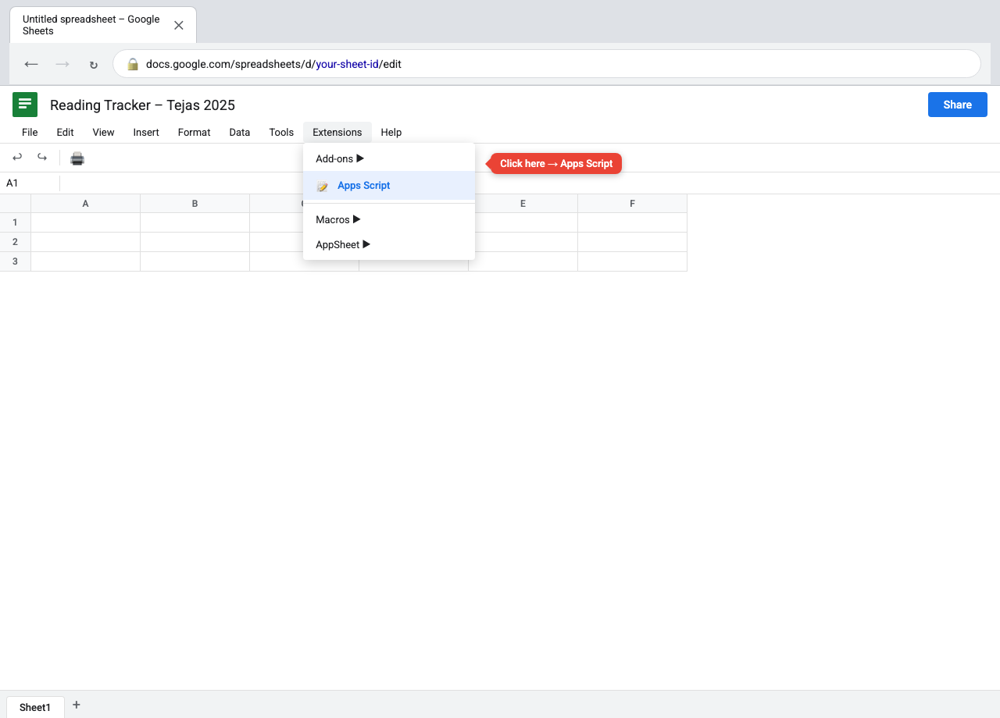

A new browser tab opens with the Apps Script editor.

---

## Step 3 — Paste the script and save

1. Select all the placeholder code in the editor (`Cmd+A` / `Ctrl+A`) and delete it.
2. Open the file **`tracker.js`** from this repository and copy its entire contents.
3. Paste it into the editor.
4. Click the **Save** button (💾) or press `Cmd+S` / `Ctrl+S`.
5. Name your project anything you like (e.g. "Reading Tracker") when prompted.

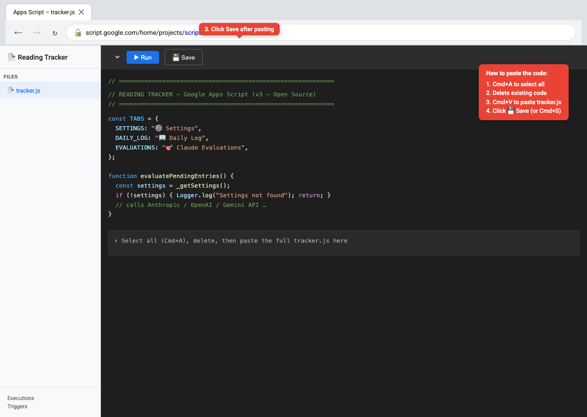

---

## Step 4 — Run the Setup Wizard

Switch back to your Google Sheet tab. Reload the page. After a few seconds a new menu item **📚 Reading Tracker** appears in the menu bar.

Click **📚 Reading Tracker → 🚀 Setup Wizard**.

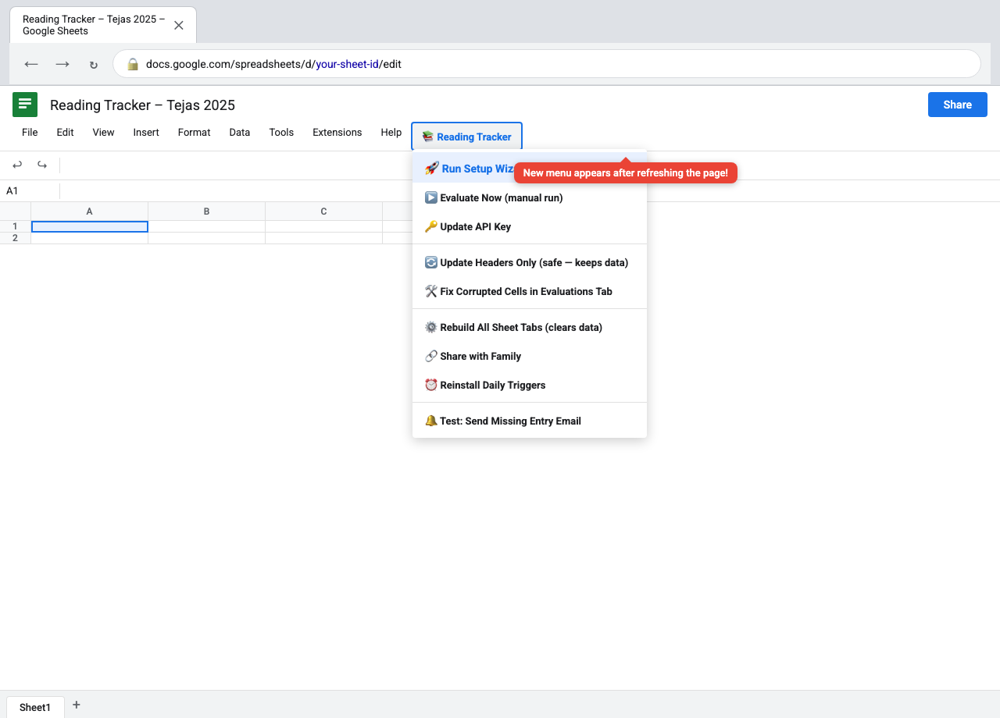

> **First-time permission prompt:** Google will ask you to authorise the script. Click **Review permissions → Advanced → Go to [project name] (unsafe) → Allow**. This is normal for self-hosted scripts.

---

## Step 5 — Fill in your family details (Wizard Step 1 of 4)

The Setup Wizard dialog opens. Enter:

- **Student name** — your child's first name
- **Grade** — e.g. 6
- **Reading days** — e.g. `Mon,Tue,Wed,Thu,Fri,Sat`
- **Morning reminder hour** — e.g. `7` for 7 AM
- **Evening evaluation hour** — e.g. `20` for 8 PM

Click **Next**.

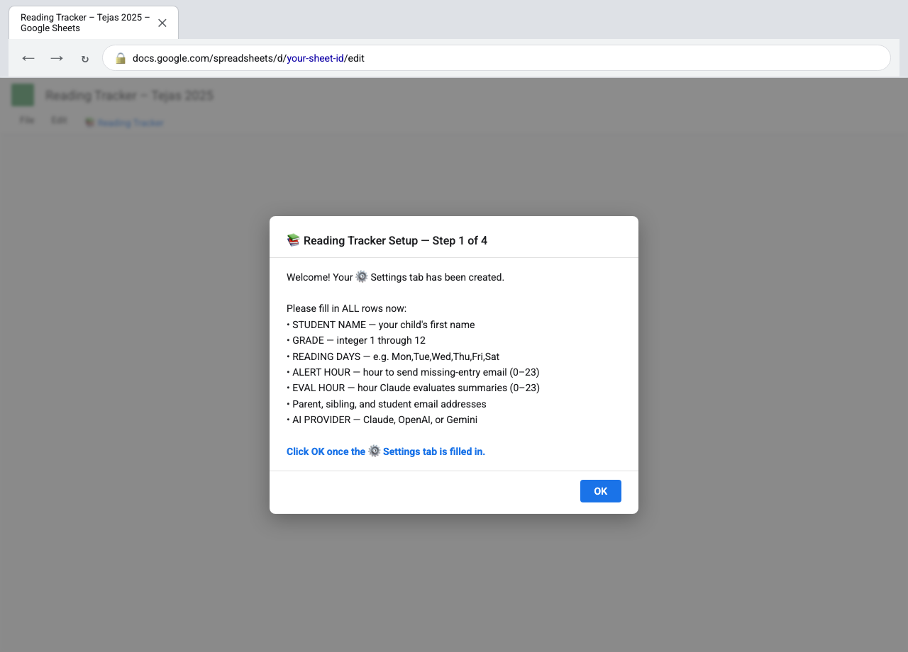

---

## Step 6 — Review the Settings tab

The wizard creates an **⚙️ Settings** tab and fills it with the values you entered. You can always edit these cells directly later.

Key settings to double-check:

| Row | Setting | Example |
|-----|---------|---------|
| 1 | STUDENT NAME | Tejas |
| 2 | GRADE | 6 |
| 6–9 | Parent emails | dad@gmail.com |
| 13 | AI PROVIDER | Claude |

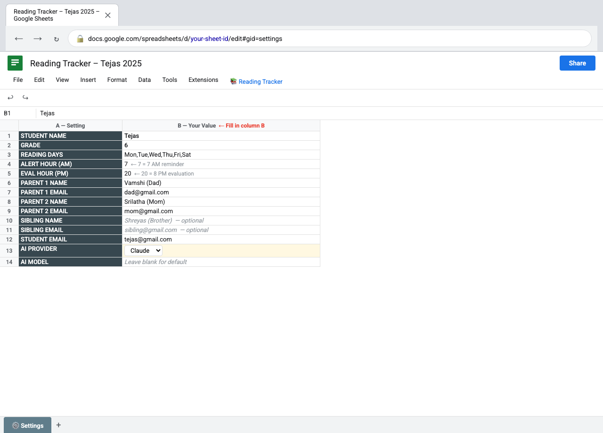

---

## Step 7 — Enter your AI provider API key

The wizard then asks for your API key. Paste it into the field (it starts with `sk-ant-...` for Claude, `sk-...` for OpenAI, or `AIza...` for Gemini).

> 🔒 The key is stored in Google's secure **Script Properties** — it never appears in any sheet cell and no one else can see it.

Click **OK**.

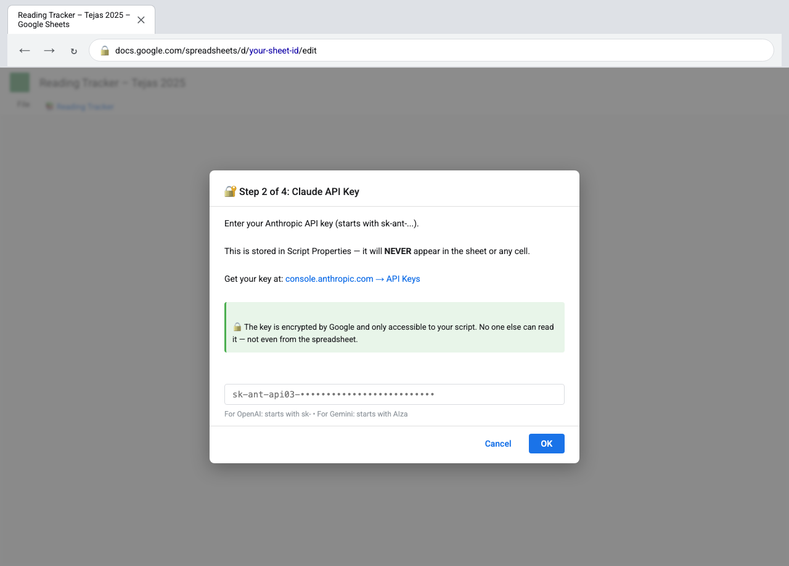

---

## Step 8 — Setup complete

The final wizard screen confirms everything is ready:

- **7:00 AM trigger** — sends a reminder if no reading entry has been logged yet
- **8:00 PM trigger** — Claude evaluates today's summary automatically

The sheet is also automatically shared with all the email addresses you entered.

Click **Done!**

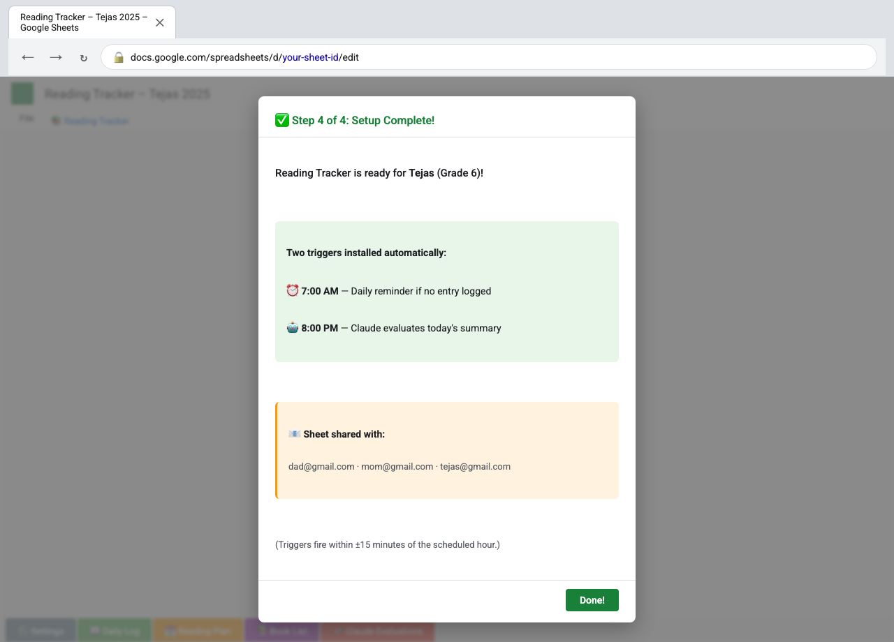

---

## Day-to-day usage

### Your child logs their reading

Every day after reading, your child opens the **📖 Daily Log** tab and fills in:

| Column | What to enter |
|--------|--------------|
| A — Date | Today's date (auto-filled if they use the template row) |
| B — Book Title | E.g. Hatchet |
| C — Chapter / Section | E.g. Chapter 3 |
| D — Start Page | E.g. 28 |
| E — End Page | E.g. 41 |
| G — Summary | 3–5 sentences in their own words |

The **Pages Read** column (F) is calculated automatically.

**Row colours at a glance:**
- 🟢 Green — Evaluated (Claude has scored it)
- 🟡 Yellow highlight in Summary cell — Written but not yet evaluated
- 🔴 Red — Missed day (no entry logged)

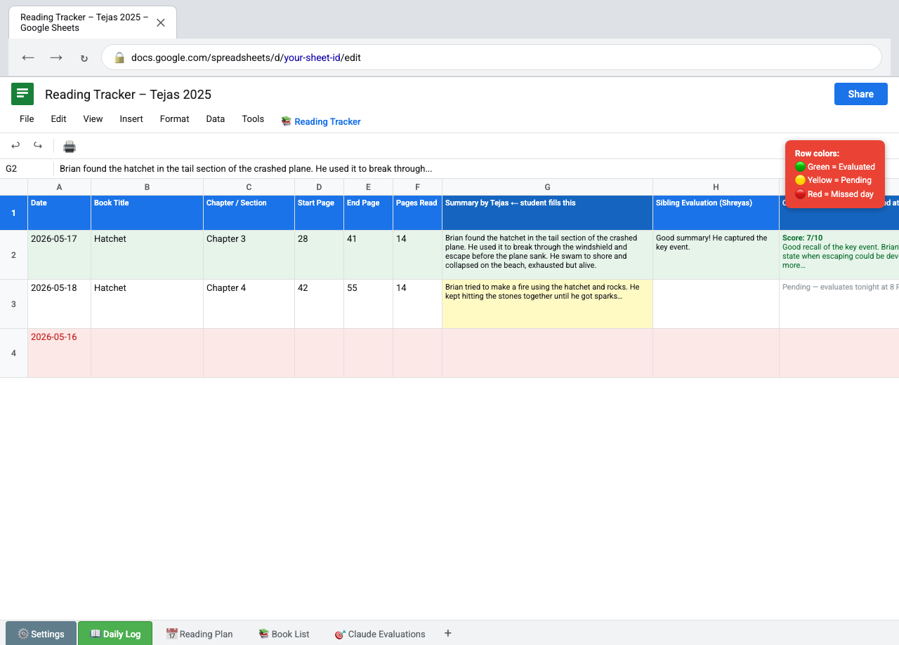

---

### Claude evaluates at 8 PM

At the time you set (default 8 PM), the script automatically:

1. Finds all rows that have a summary but no Claude score yet
2. Sends the summary to the AI provider you chose
3. Writes back to the **🎯 Claude Evaluations** tab:
   - Score (1–10)
   - Missing evidence points (in orange)
   - Improvement steps (in purple)
   - 3 follow-up questions for your child to answer

Your child can answer the questions in the **Tejas's Answers** column directly in the sheet.

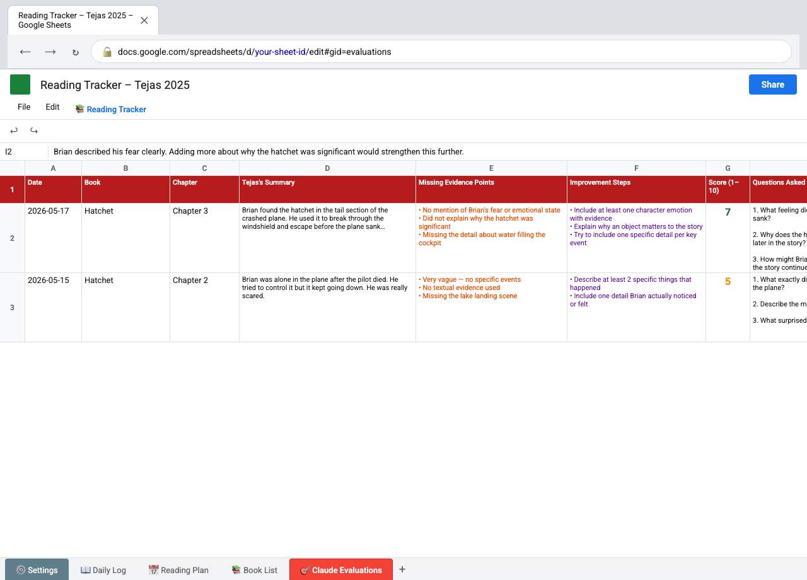

---

### The whole family gets an email

Everyone on the shared list receives a summary email that evening:

- The score and Claude's written feedback
- Missing evidence points and improvement steps as colour-coded tags
- The follow-up questions and any answers your child has written so far
- A link back to the Google Sheet

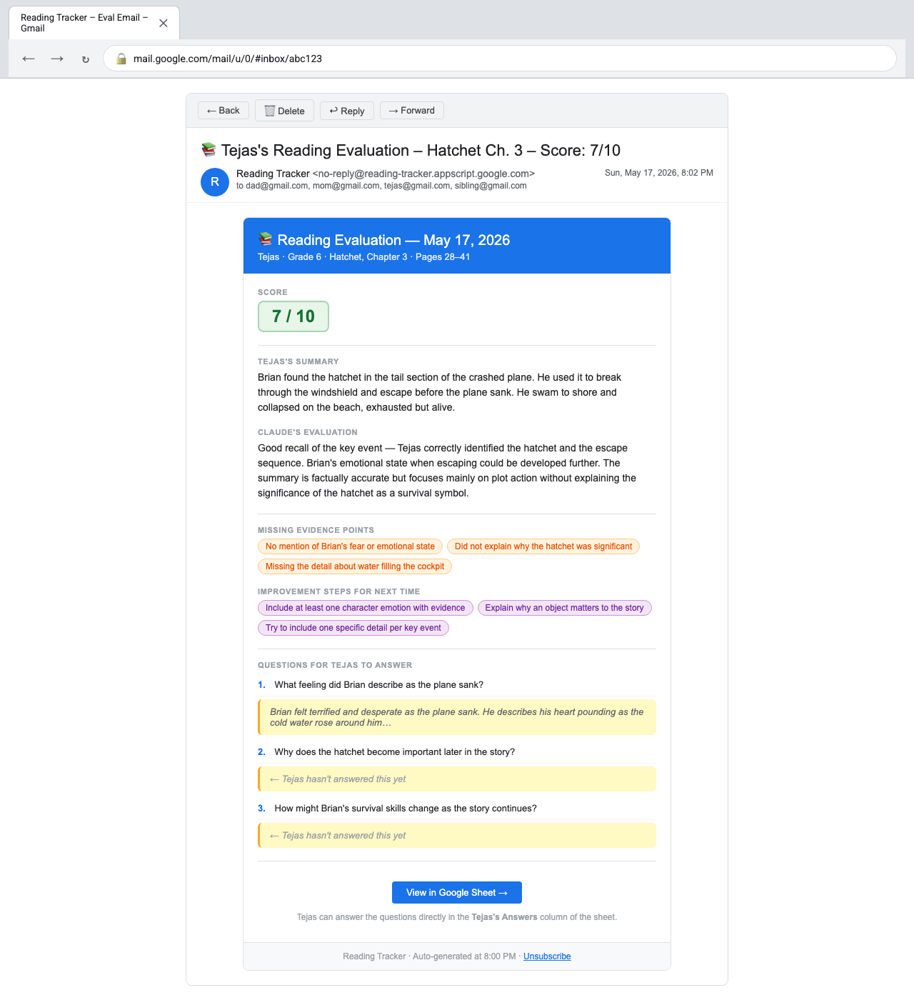

---

## Changing the AI provider later

1. Open **⚙️ Settings** tab → change row 13 (AI PROVIDER) to Claude, OpenAI, or Gemini.
2. In the menu bar click **📚 Reading Tracker → 🔑 Update API Key**.
3. Paste the new provider's key when prompted.

Future evaluations will use the new provider automatically.

---

## Troubleshooting

| Problem | Fix |
|---------|-----|
| "📚 Reading Tracker" menu is missing | Reload the sheet. First load after pasting the script can take 30 seconds. |
| "Authorization required" keeps appearing | Go to Apps Script editor → Run any function once → Complete the auth flow |
| No evaluation email arrived | Check the Evaluations tab — if the row is still blank, open Apps Script → Executions tab to see any error |
| API key error in logs | Click **🔑 Update API Key** and re-enter the key. Make sure it starts with the right prefix for your provider. |
| Missed-day row is red but child did read | They can still fill in the row — Claude will evaluate it on the next trigger run |

---

## Need help?

Open an issue at the GitHub repository or check the main [README](../README.md) for the full technical reference.
